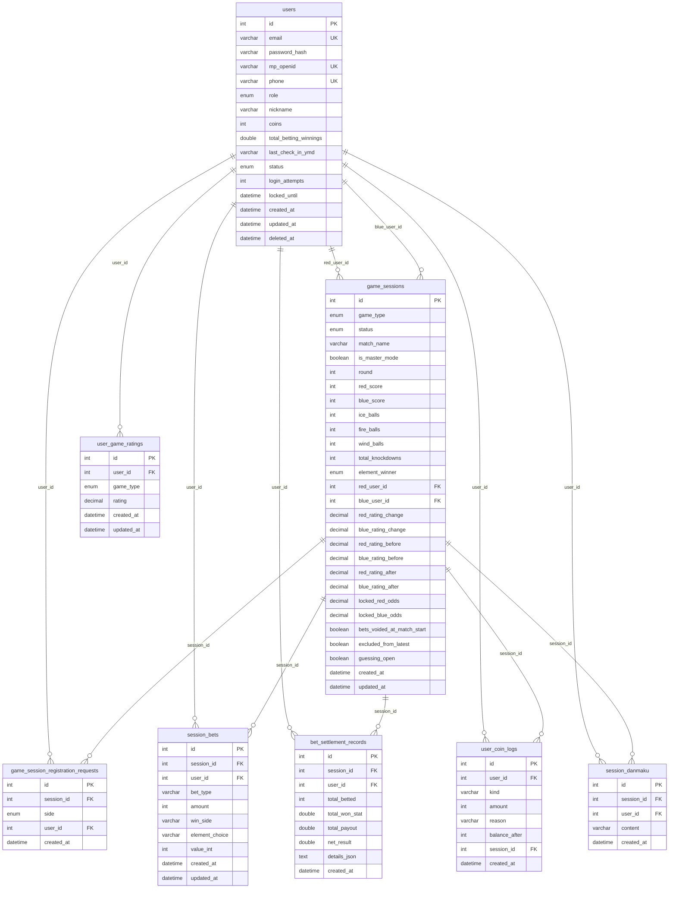

# 数据模型与 ER 关系文档

> **项目**：LumiSport · 线下运动竞技互动平台
> **版本**：v1.0（代码逆向梳理）
> **更新日期**：2026-05-11
> **数据源**：`backend/src/modules/` 全部 8 个实体文件 + 枚举 + 类型定义

---

## 目录

1. [概述](#1-概述)
2. [ER 总图](#2-er-总图)
3. [公共枚举与类型](#3-公共枚举与类型)
4. [表结构详细设计](#4-表结构详细设计)
5. [实体关系详细说明](#5-实体关系详细说明)
6. [索引设计汇总](#6-索引设计汇总)
7. [级联删除策略](#7-级联删除策略)
8. [核心业务视图（非表结构）](#8-核心业务视图非表结构)
9. [数据流向图](#9-数据流向图)
10. [附录：关键业务常量](#10-附录关键业务常量)

---

## 1. 概述

### 1.1 技术栈

| 项目 | 技术 |
|------|------|
| ORM | TypeORM（装饰器模式） |
| 数据库 | MySQL / MariaDB |
| 迁移策略 | `synchronize: true`（开发阶段自动同步） |
| 软删除 | users 表使用 `@DeleteDateColumn`（TypeORM 内置软删除） |

### 1.2 数据表总览

| # | 表名 | 实体类 | 所属模块 | 用途 |
|---|------|--------|---------|------|
| 1 | `users` | `User` | auth | 用户账户（选手 + 管理员） |
| 2 | `game_sessions` | `GameSession` | player | 比赛场次 |
| 3 | `game_session_registration_requests` | `GameSessionRegistrationRequest` | player | 选手报名申请 |
| 4 | `user_game_ratings` | `UserGameRating` | player | 按玩法独立积分 |
| 5 | `session_bets` | `SessionBet` | betting | 竞猜下注记录 |
| 6 | `bet_settlement_records` | `BetSettlementRecord` | betting | 竞猜结算汇总 |
| 7 | `user_coin_logs` | `UserCoinLog` | betting | 竞猜币收支流水 |
| 8 | `session_danmaku` | `SessionDanmaku` | danmaku | 场次弹幕 |

### 1.3 表数量统计
- **8 张**数据表
- **14 个**外键关系
- **7 个**唯一约束
- **5 个**索引

---

## 2. ER 总图

以下是完整的实体关系图（Mermaid 语法）：



### 关系一句话总结

| 关系 | 类型 | 说明 |
|------|------|------|
| User → GameSession（红方） | 1:N | 一个用户可多次作为红方参赛 |
| User → GameSession（蓝方） | 1:N | 一个用户可多次作为蓝方参赛 |
| User → RegistrationRequest | 1:N | 一个用户可提交多条报名申请 |
| GameSession → RegistrationRequest | 1:N | 一个场次可有多条报名申请 |
| User → UserGameRating | 1:N | 一个用户可有多个玩法的积分（最多 3 条） |
| User → SessionBet | 1:N | 一个用户可下多笔注 |
| GameSession → SessionBet | 1:N | 一个场次可有多笔下注 |
| User → BetSettlementRecord | 1:N | 一个用户可有多条结算记录 |
| GameSession → BetSettlementRecord | 1:N | 一个场次可有多条结算记录 |
| User → UserCoinLog | 1:N | 一个用户可有多条币变动流水 |
| GameSession → UserCoinLog | 1:N | 一个场次可关联多条币流水 |
| User → SessionDanmaku | 1:N | 一个用户可发多条弹幕 |
| GameSession → SessionDanmaku | 1:N | 一个场次可有多条弹幕 |

---

## 3. 公共枚举与类型

### 3.1 UserRole（用户角色）

```
USER  = 'user'    // 普通用户（选手 + 观众）
ADMIN = 'admin'   // 管理员
```

**约束**：
- 管理员身份与选手身份互斥（管理员不能报名参赛）
- 默认值为 `USER`

### 3.2 UserStatus（用户状态）

```
ACTIVE = 'active'  // 正常
LOCKED = 'locked'  // 锁定（登录失败 5 次触发）
```

### 3.3 GameType（游戏玩法）

```
HOCKEY  = 'hockey'   // 疾速冰球
BOXING  = 'boxing'   // 烈焰拳王
FENCING = 'fencing'  // 雷霆击剑
```

### 3.4 SessionStatus（场次状态）

```
WAITING = 'waiting'  // 等待中（管理员刚创建）
BETTING = 'betting'  // 报名中（选手可报名 + 观众可竞猜）
STARTED = 'started'  // 比赛中
SETTLED = 'settled'  // 已结算
```

**状态机流转**：`waiting → betting → started → settled`

### 3.5 SessionBetTypeKey（竞猜类型）

```
winBet          // 胜负竞猜
elementKing     // 元素之王（冰球大师模式）
knockdownKing   // 倒地之王（拳王模式）
preciseTotal    // 精确总分
preciseDiff     // 精确分差
```

### 3.6 CoinLogKind（竞猜币变动方向）

```
spend = 'spend'  // 支出
gain  = 'gain'   // 收入
```

### 3.7 Side（红蓝阵营）

```
red  = 'red'    // 红方
blue = 'blue'   // 蓝方
```

### 3.8 ElementWinner（元素胜者）

```
ice  = 'ice'    // 冰
fire = 'fire'   // 火
wind = 'wind'   // 风
```

---

## 4. 表结构详细设计

### 4.1 users 用户表

> **实体文件**：`modules/auth/entities/user.entity.ts`
> **用途**：存储全部用户（选手 + 管理员）的账户信息，含竞猜资产

| # | 字段名 | 列名 | 类型 | 约束 | 默认值 | 说明 |
|---|--------|------|------|------|--------|------|
| 1 | id | `id` | INT | PK, AUTO_INCREMENT | — | 主键 |
| 2 | email | `email` | VARCHAR(255) | **UNIQUE**, NULLABLE | NULL | 邮箱（管理员登录 / 邮箱密码登录） |
| 3 | passwordHash | `password_hash` | VARCHAR(255) | NULLABLE | NULL | bcrypt 密码哈希 |
| 4 | mpOpenid | `mp_openid` | VARCHAR(64) | **UNIQUE**, NULLABLE | NULL | 微信小程序 OpenID |
| 5 | phone | `phone` | VARCHAR(20) | **UNIQUE**, NULLABLE | NULL | 手机号 |
| 6 | role | `role` | ENUM(user, admin) | NOT NULL | `user` | 角色：普通用户 / 管理员 |
| 7 | nickname | `nickname` | VARCHAR(100) | NULLABLE | NULL | 用户昵称（可编辑） |
| 8 | coins | `coins` | INT | NOT NULL | `0` | 竞猜币余额 |
| 9 | totalBettingWinnings | `total_betting_winnings` | DOUBLE | NOT NULL | `0` | 累计竞猜派奖（猜中项合计，用于段位计算） |
| 10 | lastCheckInYmd | `last_check_in_ymd` | VARCHAR(10) | NULLABLE | NULL | 上次签到日（`YYYY-MM-DD`，Asia/Shanghai） |
| 11 | status | `status` | ENUM(active, locked) | NOT NULL | `active` | 账户状态 |
| 12 | loginAttempts | `login_attempts` | INT | NOT NULL | `0` | 连续登录失败次数 |
| 13 | lockedUntil | `locked_until` | DATETIME | NULLABLE | NULL | 账户锁定截止时间 |
| 14 | createdAt | `created_at` | DATETIME | NOT NULL | AUTO | 创建时间 |
| 15 | updatedAt | `updated_at` | DATETIME | NOT NULL | AUTO | 更新时间 |
| 16 | deletedAt | `deleted_at` | DATETIME | NULLABLE | NULL | 软删除时间（TypeORM `@DeleteDateColumn`） |

**唯一约束**：
- `email` → 同一邮箱不可重复注册
- `mp_openid` → 同一微信 OpenID 不可重复绑定
- `phone` → 同一手机号不可重复绑定

**业务规则**：
- 管理员 (`role=admin`) 通过 `email` + 免密登录，`mp_openid` 通常为 NULL
- 普通用户 (`role=user`) 通过 `mp_openid` 微信登录，`email` 通常为 NULL
- `total_betting_winnings` 仅在竞猜结算时累加，直接影响预言家段位

---

### 4.2 game_sessions 场次表

> **实体文件**：`modules/player/entities/game-session.entity.ts`
> **用途**：存储每一场比赛的完整生命周期数据

| # | 字段名 | 列名 | 类型 | 约束 | 默认值 | 说明 |
|---|--------|------|------|------|--------|------|
| 1 | id | `id` | INT | PK, AUTO_INCREMENT | — | 主键（场次 ID） |
| 2 | gameType | `game_type` | ENUM(hockey, boxing, fencing) | NOT NULL | — | 游戏玩法 |
| 3 | status | `status` | ENUM(waiting, betting, started, settled) | NOT NULL | — | 场次状态 |
| 4 | matchName | `match_name` | VARCHAR(200) | NULLABLE | NULL | 比赛名称 |
| 5 | isMasterMode | `is_master_mode` | BOOLEAN | NOT NULL | `true` | 冰球大师模式开关 |
| 6 | round | `round` | INT | NOT NULL | `1` | 局数（下一轮递增） |
| 7 | redScore | `red_score` | INT | NULLABLE | NULL | 红方得分 |
| 8 | blueScore | `blue_score` | INT | NULLABLE | NULL | 蓝方得分 |
| 9 | iceBalls | `ice_balls` | INT | NULLABLE | NULL | 冰球次数（冰球大师模式） |
| 10 | fireBalls | `fire_balls` | INT | NULLABLE | NULL | 火球次数（冰球大师模式） |
| 11 | windBalls | `wind_balls` | INT | NULLABLE | NULL | 风球次数（冰球大师模式） |
| 12 | totalKnockdowns | `total_knockdowns` | INT | NULLABLE | NULL | 总倒地次数（拳王模式） |
| 13 | elementWinner | `element_winner` | ENUM(ice, fire, wind) | NULLABLE | NULL | 元素之王胜出元素 |
| 14 | redUserId | `red_user_id` | INT | FK → users.id, NULLABLE | NULL | 红方选手 |
| 15 | blueUserId | `blue_user_id` | INT | FK → users.id, NULLABLE | NULL | 蓝方选手 |
| 16 | redRatingChange | `red_rating_change` | DECIMAL(10,2) | NULLABLE | NULL | 红方积分变化 |
| 17 | blueRatingChange | `blue_rating_change` | DECIMAL(10,2) | NULLABLE | NULL | 蓝方积分变化 |
| 18 | redRatingBefore | `red_rating_before` | DECIMAL(10,2) | NULLABLE | NULL | 红方结算前积分快照 |
| 19 | blueRatingBefore | `blue_rating_before` | DECIMAL(10,2) | NULLABLE | NULL | 蓝方结算前积分快照 |
| 20 | redRatingAfter | `red_rating_after` | DECIMAL(10,2) | NULLABLE | NULL | 红方结算后积分快照 |
| 21 | blueRatingAfter | `blue_rating_after` | DECIMAL(10,2) | NULLABLE | NULL | 蓝方结算后积分快照 |
| 22 | lockedRedOdds | `locked_red_odds` | DECIMAL(10,2) | NULLABLE | NULL | 锁定的红方赔率 |
| 23 | lockedBlueOdds | `locked_blue_odds` | DECIMAL(10,2) | NULLABLE | NULL | 锁定的蓝方赔率 |
| 24 | betsVoidedAtMatchStart | `bets_voided_at_match_start` | BOOLEAN | NOT NULL | `false` | 开赛流局标记 |
| 25 | excludedFromLatest | `excluded_from_latest` | BOOLEAN | NOT NULL | `false` | 排除出「最新场次」 |
| 26 | guessingOpen | `guessing_open` | BOOLEAN | NOT NULL | `false` | 竞猜开关（管理员控制） |
| 27 | createdAt | `created_at` | DATETIME | NOT NULL | AUTO | 创建时间 |
| 28 | updatedAt | `updated_at` | DATETIME | NOT NULL | AUTO | 更新时间 |

**外键关系**：
- `red_user_id` → `users.id`（`SET NULL`：用户删除时置空）
- `blue_user_id` → `users.id`（`SET NULL`：用户删除时置空）

**按玩法字段使用矩阵**：

| 字段 | 冰球（大师） | 冰球（普通） | 拳王 | 击剑 |
|------|:---:|:---:|:---:|:---:|
| red_score / blue_score | ✔ | ✔ | ✔ | ✔ |
| ice_balls / fire_balls / wind_balls | ✔ | ✖ | ✖ | ✖ |
| element_winner | ✔ | ✖ | ✖ | ✖ |
| total_knockdowns | ✖ | ✖ | ✔ | ✖ |
| is_master_mode | ✔ | ✂ | ✖ | ✖ |

---

### 4.3 game_session_registration_requests 报名申请表

> **实体文件**：`modules/player/entities/game-session-registration-request.entity.ts`
> **用途**：记录选手的报名申请（待管理员审核）

| # | 字段名 | 列名 | 类型 | 约束 | 默认值 | 说明 |
|---|--------|------|------|------|--------|------|
| 1 | id | `id` | INT | PK, AUTO_INCREMENT | — | 主键 |
| 2 | sessionId | `session_id` | INT | FK → game_sessions.id, NOT NULL | — | 所属场次 |
| 3 | side | `side` | ENUM(red, blue) | NOT NULL | — | 申请阵营 |
| 4 | userId | `user_id` | INT | FK → users.id, NOT NULL | — | 申请人 |
| 5 | createdAt | `created_at` | DATETIME | NOT NULL | AUTO | 申请时间 |

**唯一约束**：
- `UQ_registration_session_user`（`session_id` + `user_id`）→ 同一场次同一用户只能有一条申请

**索引**：
- `IDX_registration_session_side`（`session_id` + `side`）→ 按场次+阵营查询待审列表

**外键关系**：
- `session_id` → `game_sessions.id`（`CASCADE`：场次删除时级联删除）
- `user_id` → `users.id`（`CASCADE`：用户删除时级联删除）

**业务规则**：
- 管理员通过某条申请后，同侧其余申请全部删除
- 仅 `betting` 状态的场次可提交申请

---

### 4.4 user_game_ratings 用户玩法积分表

> **实体文件**：`modules/player/entities/user-game-rating.entity.ts`
> **用途**：存储每个用户在每种玩法下的独立积分

| # | 字段名 | 列名 | 类型 | 约束 | 默认值 | 说明 |
|---|--------|------|------|------|--------|------|
| 1 | id | `id` | INT | PK, AUTO_INCREMENT | — | 主键 |
| 2 | userId | `user_id` | INT | FK → users.id, NOT NULL | — | 所属用户 |
| 3 | gameType | `game_type` | ENUM(hockey, boxing, fencing) | NOT NULL | — | 玩法类型 |
| 4 | rating | `rating` | DECIMAL(10,2) | NOT NULL | `100` | 积分值（初始 100） |
| 5 | createdAt | `created_at` | DATETIME | NOT NULL | AUTO | 创建时间 |
| 6 | updatedAt | `updated_at` | DATETIME | NOT NULL | AUTO | 更新时间 |

**唯一约束**：
- `UQ_user_game_ratings_user_game`（`user_id` + `game_type`）→ 每个用户每个玩法仅一条记录

**外键关系**：
- `user_id` → `users.id`（`CASCADE`：用户删除时级联删除）

**业务规则**：
- 初始积分 100，结算后按公式更新：`20 × (对手积分 / 双方积分之和)`
- 用户首次参与某玩法时自动创建记录

---

### 4.5 session_bets 竞猜下注表

> **实体文件**：`modules/betting/entities/session-bet.entity.ts`
> **用途**：记录每笔竞猜下注的详细信息

| # | 字段名 | 列名 | 类型 | 约束 | 默认值 | 说明 |
|---|--------|------|------|------|--------|------|
| 1 | id | `id` | INT | PK, AUTO_INCREMENT | — | 主键 |
| 2 | sessionId | `session_id` | INT | FK → game_sessions.id, NOT NULL | — | 所属场次 |
| 3 | userId | `user_id` | INT | FK → users.id, NOT NULL | — | 下注用户 |
| 4 | betType | `bet_type` | VARCHAR(32) | NOT NULL | — | 竞猜类型（见 3.5） |
| 5 | amount | `amount` | INT | NOT NULL | — | 下注金额（竞猜币） |
| 6 | winSide | `win_side` | VARCHAR(8) | NULLABLE | NULL | 胜负竞猜选择（red / blue） |
| 7 | elementChoice | `element_choice` | VARCHAR(8) | NULLABLE | NULL | 元素之王选择（ice / fire / wind） |
| 8 | valueInt | `value_int` | INT | NULLABLE | NULL | 预测值（倒地次数 / 精确总分 / 精确分差） |
| 9 | createdAt | `created_at` | DATETIME | NOT NULL | AUTO | 下注时间 |
| 10 | updatedAt | `updated_at` | DATETIME | NOT NULL | AUTO | 更新时间（覆盖下注时更新） |

**唯一约束**：
- `UQ_session_user_bet_type`（`session_id` + `user_id` + `bet_type`）→ 同一场次同一用户每种竞猜类型仅一条

**索引**：
- `session_id` → 按场次查询全部下注

**外键关系**：
- `session_id` → `game_sessions.id`（`CASCADE`：场次删除时级联删除）
- `user_id` → `users.id`（`CASCADE`：用户删除时级联删除）

**betType × 字段使用矩阵**：

| betType | winSide | elementChoice | valueInt | 适用玩法 |
|---------|:-------:|:-------------:|:--------:|---------|
| winBet | ✔ | ✖ | ✖ | 全部 |
| elementKing | ✖ | ✔ | ✖ | 冰球（大师） |
| knockdownKing | ✖ | ✖ | ✔ | 拳王 |
| preciseTotal | ✖ | ✖ | ✔ | 全部 |
| preciseDiff | ✖ | ✖ | ✔ | 全部 |

---

### 4.6 bet_settlement_records 竞猜结算记录表

> **实体文件**：`modules/betting/entities/bet-settlement-record.entity.ts`
> **用途**：存储每场竞猜的结算汇总（每用户每场次一条）

| # | 字段名 | 列名 | 类型 | 约束 | 默认值 | 说明 |
|---|--------|------|------|------|--------|------|
| 1 | id | `id` | INT | PK, AUTO_INCREMENT | — | 主键 |
| 2 | sessionId | `session_id` | INT | FK → game_sessions.id, NOT NULL | — | 所属场次 |
| 3 | userId | `user_id` | INT | FK → users.id, NOT NULL | — | 用户 |
| 4 | totalBetted | `total_betted` | INT | NOT NULL | — | 本局下注本金合计 |
| 5 | totalWonStat | `total_won_stat` | DOUBLE | NOT NULL | — | 猜中项派奖合计（不含平局退还） |
| 6 | totalPayout | `total_payout` | DOUBLE | NOT NULL | — | 实际发放总额（派奖 + 退还） |
| 7 | netResult | `net_result` | DOUBLE | NOT NULL | — | 净盈亏（`totalPayout - totalBetted`） |
| 8 | detailsJson | `details_json` | TEXT | NOT NULL | — | 结算明细（JSON 数组） |
| 9 | createdAt | `created_at` | DATETIME | NOT NULL | AUTO | 结算时间 |

**索引**：
- `userId + createdAt` → 按用户查询竞猜历史（时间排序）

**外键关系**：
- `session_id` → `game_sessions.id`（`CASCADE`：场次删除时级联删除）
- `user_id` → `users.id`（`CASCADE`：用户删除时级联删除）

**detailsJson 结构**（`BetSettlementDetailLine[]`）：

```json
[
  {
    "type": "winBet",
    "myBet": "red",
    "amount": 50,
    "actual": "red",
    "result": "won",
    "won": 75.0,
    "lost": null,
    "refund": null
  }
]
```

**三个金额指标的区别**：
- `totalBetted`：用户在本局所有下注的本金总和
- `totalWonStat`：仅「猜中」项的派奖合计，用于段位累计（`users.total_betting_winnings`）
- `totalPayout`：实际到账总额，含猜中派奖 + 平局退还等全部
- `netResult = totalPayout - totalBetted`：净盈亏（正=赚，负=亏，零=持平）

---

### 4.7 user_coin_logs 竞猜币流水表

> **实体文件**：`modules/betting/entities/user-coin-log.entity.ts`
> **用途**：记录每一笔竞猜币的变动明细

| # | 字段名 | 列名 | 类型 | 约束 | 默认值 | 说明 |
|---|--------|------|------|------|--------|------|
| 1 | id | `id` | INT | PK, AUTO_INCREMENT | — | 主键 |
| 2 | userId | `user_id` | INT | FK → users.id, NOT NULL | — | 所属用户 |
| 3 | kind | `kind` | VARCHAR(16) | NOT NULL | — | 变动方向（`spend` / `gain`） |
| 4 | amount | `amount` | INT | NOT NULL | — | 变动数量（正数） |
| 5 | reason | `reason` | VARCHAR(500) | NOT NULL | — | 变动原因描述 |
| 6 | balanceAfter | `balance_after` | INT | NOT NULL | — | 变动后余额 |
| 7 | sessionId | `session_id` | INT | FK → game_sessions.id, NULLABLE | NULL | 关联赛次（签到时为 NULL） |
| 8 | createdAt | `created_at` | DATETIME | NOT NULL | AUTO | 变动时间 |

**索引**：
- `userId + createdAt` → 按用户查询流水（时间排序）

**外键关系**：
- `user_id` → `users.id`（`CASCADE`：用户删除时级联删除）
- `session_id` → `game_sessions.id`（`SET NULL`：场次删除时置空）

**reason 枚举值**：

| reason | kind | 触发场景 |
|--------|------|---------|
| 下注：{betType} | spend | 用户下注 |
| 退还：{betType}（{原因}） | gain | 流局退还 / 取消退还 |
| 派奖：{betType} | gain | 竞猜猜中 |
| 每日签到奖励 | gain | 每日签到 |

---

### 4.8 session_danmaku 弹幕表

> **实体文件**：`modules/danmaku/entities/session-danmaku.entity.ts`
> **用途**：存储场次弹幕消息

| # | 字段名 | 列名 | 类型 | 约束 | 默认值 | 说明 |
|---|--------|------|------|------|--------|------|
| 1 | id | `id` | INT | PK, AUTO_INCREMENT | — | 主键 |
| 2 | sessionId | `session_id` | INT | FK → game_sessions.id, NOT NULL | — | 所属场次 |
| 3 | userId | `user_id` | INT | FK → users.id, NOT NULL | — | 发送者 |
| 4 | content | `content` | VARCHAR(120) | NOT NULL | — | 弹幕内容（敏感词已过滤） |
| 5 | createdAt | `created_at` | DATETIME(6) | NOT NULL | AUTO | 发送时间（精度到微秒） |

**外键关系**：
- `session_id` → `game_sessions.id`（`CASCADE`：场次删除时级联删除）
- `user_id` → `users.id`（`CASCADE`：用户删除时级联删除）

**业务规则**：
- 内容最大长度 120 字符（前端限制 80，后端限制 120）
- 敏感词在写入前已过滤替换为 `*`
- 按场次隔离，拉取时使用增量游标 `afterId`

---

## 5. 实体关系详细说明

### 5.1 核心关联路径

| 业务场景 | 关联路径 |
|---------|---------|
| 用户参赛 | `users` → `game_sessions`（red_user_id / blue_user_id） |
| 用户报名 | `users` → `game_session_registration_requests` → `game_sessions` |
| 用户积分 | `users` → `user_game_ratings`（按 game_type 区分） |
| 用户竞猜 | `users` → `session_bets` → `game_sessions` |
| 竞猜结算 | `session_bets` → 结算计算 → `bet_settlement_records` + `user_coin_logs` |
| 用户发弹幕 | `users` → `session_danmaku` → `game_sessions` |
| 签到领币 | `users.last_check_in_ymd` + `user_coin_logs`（session_id = NULL） |

---

## 6. 索引设计汇总

| 表名 | 索引名 | 索引列 | 类型 | 用途 |
|------|--------|--------|------|------|
| users | — | `email` | UNIQUE | 管理员邮箱登录唯一性 |
| users | — | `mp_openid` | UNIQUE | 微信登录唯一性 |
| users | — | `phone` | UNIQUE | 手机号唯一性 |
| game_session_registration_requests | `UQ_registration_session_user` | `session_id` + `user_id` | UNIQUE | 同场次同用户仅一条申请 |
| game_session_registration_requests | `IDX_registration_session_side` | `session_id` + `side` | INDEX | 按场次+阵营查询待审列表 |
| user_game_ratings | `UQ_user_game_ratings_user_game` | `user_id` + `game_type` | UNIQUE | 每用户每玩法仅一条记录 |
| session_bets | `UQ_session_user_bet_type` | `session_id` + `user_id` + `bet_type` | UNIQUE | 同场次同用户同类型仅一条 |
| session_bets | — | `session_id` | INDEX | 按场次查全部下注 |
| bet_settlement_records | — | `user_id` + `created_at` | INDEX | 按用户查竞猜历史 |
| user_coin_logs | — | `user_id` + `created_at` | INDEX | 按用户查流水 |

---

## 7. 级联删除策略

| 子表 | 外键列 | 父表 | 级联策略 | 说明 |
|------|--------|------|---------|------|
| game_sessions | `red_user_id` | users | **SET NULL** | 用户删除后场次保留，选手置空 |
| game_sessions | `blue_user_id` | users | **SET NULL** | 同上 |
| game_session_registration_requests | `session_id` | game_sessions | **CASCADE** | 场次删除时申请随之删除 |
| game_session_registration_requests | `user_id` | users | **CASCADE** | 用户删除时申请随之删除 |
| user_game_ratings | `user_id` | users | **CASCADE** | 用户删除时积分随之删除 |
| session_bets | `session_id` | game_sessions | **CASCADE** | 场次删除时下注随之删除 |
| session_bets | `user_id` | users | **CASCADE** | 用户删除时下注随之删除 |
| bet_settlement_records | `session_id` | game_sessions | **CASCADE** | 场次删除时结算随之删除 |
| bet_settlement_records | `user_id` | users | **CASCADE** | 用户删除时结算随之删除 |
| user_coin_logs | `user_id` | users | **CASCADE** | 用户删除时流水随之删除 |
| user_coin_logs | `session_id` | game_sessions | **SET NULL** | 场次删除后流水保留但关联回空 |
| session_danmaku | `session_id` | game_sessions | **CASCADE** | 场次删除时弹幕随之删除 |
| session_danmaku | `user_id` | users | **CASCADE** | 用户删除时弹幕随之删除 |

**设计原则**：
- **场次删除**：所有子表级联删除（session_bets / settlement / registration / danmaku）
- **用户删除**：赛事记录保留（SET NULL），其余子表级联删除
- **签到流水**：`user_coin_logs.session_id` 可为 NULL（签到不关联赛次）

---

## 8. 核心业务视图（非表结构）

以下结构不在数据库中持久化，而是由 Service 层在查询时动态构建的**视图模型（DTO）**：

### 8.1 PlayerSessionView（选手端场次视图）

| 字段 | 来源 | 说明 |
|------|------|------|
| sessionId | game_sessions.id | 场次 ID |
| round | game_sessions.round | 局数 |
| gameType | game_sessions.game_type | 玩法 |
| status | game_sessions.status | 状态 |
| redPlayer | users（via red_user_id） | `{ id, displayName }` |
| bluePlayer | users（via blue_user_id） | `{ id, displayName }` |
| redPendingPlayers | registration_requests + users | 待审红方列表 |
| bluePendingPlayers | registration_requests + users | 待审蓝方列表 |
| redRating | user_game_ratings.rating | 红方该玩法积分 |
| blueRating | user_game_ratings.rating | 蓝方该玩法积分 |
| mySide | — | 当前用户角色（red / blue / null） |
| myPendingSide | — | 当前用户待审阵营 |
| guessingOpen | game_sessions.guessing_open | 竞猜开关 |
| lastSettledMatch | 上一场 settled 的 GameSession | 上一局结果摘要 |

### 8.2 BettingStatePayload（竞猜状态视图）

| 字段 | 来源 | 说明 |
|------|------|------|
| odds | user_game_ratings 实时计算 | 动态赔率（未锁场）或锁定赔率 |
| lockedOdds | game_sessions.locked_red/blue_odds | 锁场后的赔率快照 |
| winBetEnabled | 多条件综合判定 | 胜负竞猜是否开放 |
| winBetBlockedType | 实力悬殊判定 | 封盘原因 |
| myBets | session_bets（当前用户） | 当前用户已下注情况 |
| canCheckInToday | users.last_check_in_ymd | 今日是否可签到 |

### 8.3 BetPoolPayload（竞猜大盘池）

| 字段 | 来源 | 说明 |
|------|------|------|
| winBet.red/blue | session_bets 聚合 | 胜负竞猜双方统计 |
| elementKing.ice/fire/wind | session_bets 聚合 | 元素之王三项统计 |
| knockdownKing | session_bets 聚合 | 倒地之王统计（按 value_int 分组） |
| preciseTotal | session_bets 聚合 | 精确总分统计（按 value_int 分组） |
| preciseDiff | session_bets 聚合 | 精确分差统计（按 value_int 分组） |

### 8.4 预言家段位（内存计算）

| 段位 | 阈值（total_betting_winnings） | 图标 |
|------|------|------|
| 新手预言家 | 0 | 🔮 |
| 青铜预言家 | 2,500 | 🥉 |
| 白银预言家 | 5,000 | 🥈 |
| 黄金预言家 | 10,000 | 🥇 |
| 钻石预言家 | 20,000 | 💎 |
| 铂金预言家 | 50,000 | 👑 |
| 王者预言家 | 100,000 | 🏆 |

> 段位不存储在数据库中，每次查询时根据 `users.total_betting_winnings` 实时计算。

---

## 9. 数据流向图

### 9.1 场次生命周期数据流

```
管理员创建场次    →
    → game_sessions (status=waiting)
    → 管理员切换到报名阶段
game_sessions (status=betting)
    ├── 选手报名 → game_session_registration_requests
    │       └── 管理员审核通过 → game_sessions.red/blue_user_id 更新
    │                          registration_requests 同侧清理
    ├── 管理员开启竞猜 → game_sessions.guessing_open = true
    │       └── 观众下注 → session_bets
    │                    user_coin_logs (kind=spend)
    │                    users.coins 扣减
    → 管理员开赛
game_sessions (status=started)
    ├── 锁定赔率 → game_sessions.locked_red/blue_odds
    ├── 流局检测 → game_sessions.bets_voided_at_match_start = true
    │       └── 全额退款 → user_coin_logs (kind=gain)
    │                    session_bets 全部退还
    → 管理员录入结果 + 结算
game_sessions (status=settled)
    ├── 更新比分 → game_sessions.red/blue_score + 玩法字段
    ├── 积分结算 → user_game_ratings.rating 更新
    │             game_sessions.red/blue_rating_change/before/after 写入
    ├── 竞猜结算 → bet_settlement_records 写入
    │             user_coin_logs (kind=gain, 派奖+退还)
    │             users.coins 增加
    │             users.total_betting_winnings 累加
    → 管理员「下一轮」game_sessions (status=betting, round+1)
    管理员「返回首页」game_sessions.excluded_from_latest = true → 新建下一场
```

### 9.2 竞猜币流向

```
                    ┌─────────────┐
                    │ users.coins │
                    └──────┬──────┘
                           │
            ┌──────────────┼──────────────┐
            │              │              │
        +100/签到      -amount/下注    +payout/结算
            │              │              │
            │              │              │
    user_coin_logs   user_coin_logs  user_coin_logs
    (kind=gain)      (kind=spend)   (kind=gain)
    (session=NULL)   (session=X)    (session=X)
```

---

## 10. 附录：关键业务常量

| 常量名 | 值 | 用途 |
|--------|------|------|
| BET_MIN_AMOUNT | `10` | 单次下注最低竞猜币 |
| ODDS_ELEMENT_KING | `3` | 元素之王固定赔率 |
| ODDS_KNOCKDOWN_KING | `3` | 倒地之王固定赔率 |
| ODDS_PRECISE_TOTAL | `20` | 精确总分固定赔率 |
| ODDS_PRECISE_DIFF | `15` | 精确分差固定赔率 |
| START_MATCH_VOID_MAX_WIN_RATE | `0.8` | 实力悬殊判定阈值（80%） |
| DAILY_CHECK_IN_COINS | `100` | 每日签到奖励竞猜币 |
| INITIAL_RATING | `100` | 新用户默认积分 |
| LOGIN_MAX_ATTEMPTS | `5` | 连续登录失败锁定阈值 |
| LOGIN_LOCK_MINUTES | `30` | 锁定时长（分钟） |

---

> **文档维护说明**：本文档基于代码实体文件逆向生成，如代码发生变更（新增字段、修改枚举、调整约束），需同步更新本文档。
